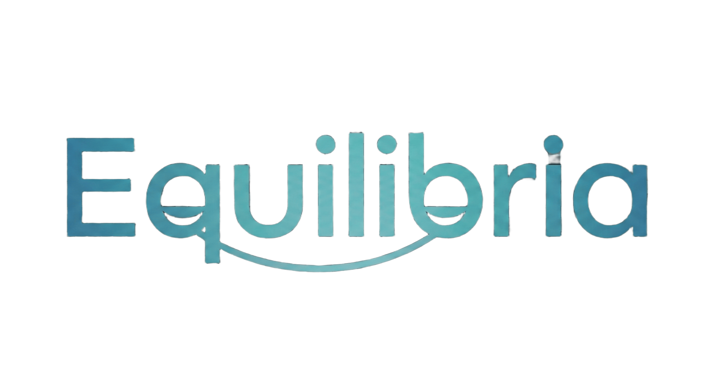

# Equilibria - Smart Scale Balance

  

PT - PT 
Este projeto foi desenvolvido no âmbito da unidade curricular de Sistemas Embebidos e consiste na criação de uma balança inteligente capaz de identificar automaticamente o produto colocado na sua superfície, sem necessidade de códigos de barras ou introdução manual de dados.

A solução integra um sistema de visão por computador baseado no modelo YOLO para detecção e classificação de objetos (por exemplo, frutas). Paralelamente, são utilizadas células de carga para medir o peso do produto com precisão. Todo o processamento é realizado por um Raspberry Pi 5, responsável por executar o modelo de IA e gerir a lógica do sistema.

Após identificar o produto através do YOLO, o Raspberry Pi comunica com uma API desenvolvida em Node.js, que fornece informação adicional, como o nome do fruto e o respetivo preço por quilograma. A partir destes dados e da medição de peso, é calculado o preço final.

Os resultados são apresentados em tempo real num CYD (Cheap Yellow Display), onde é também disponibilizado um botão físico que permite imprimir o preço final após a pesagem.

Este projeto demonstra a integração de IA, sistemas embebidos e software backend para criar um dispositivo autónomo, intuitivo e funcional.

---

EN - UK 
This project was developed for the Embedded Systems course and consists of building a smart scale capable of automatically identifying the product placed on its platform, without requiring barcodes or manual input.

The system uses a computer vision model based on YOLO for object detection and classification (e.g., fruits). In parallel, load cells are used to accurately measure the product’s weight. All processing is handled by a Raspberry Pi 5, which runs the AI model and manages the system logic.

After YOLO identifies the product, the Raspberry Pi communicates with a Node.js API that provides additional information, such as the fruit’s name and its price per kilogram. Using the weight measurement, the system calculates the final price.

All information is displayed in real time on a CYD (Cheap Yellow Display), which also includes a physical button allowing the user to print the final price once the weighing process is completed.

This project showcases the integration of AI, embedded hardware and backend software to create an autonomous, intuitive and functional device.
